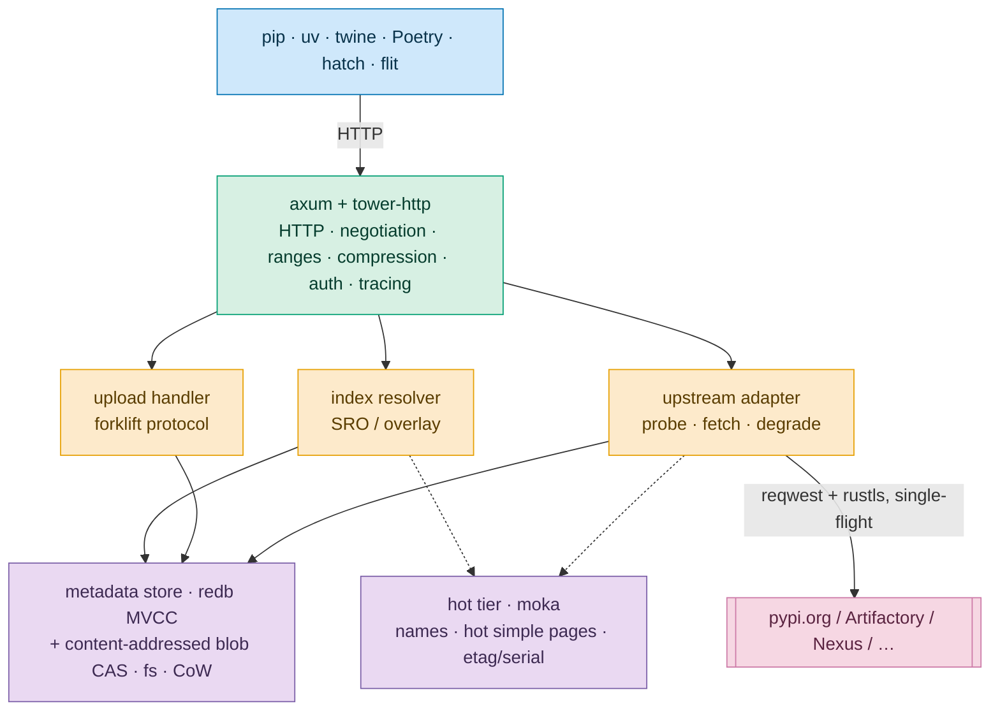
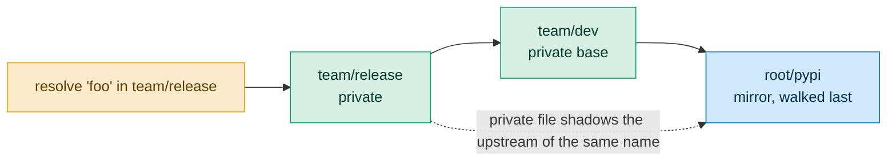
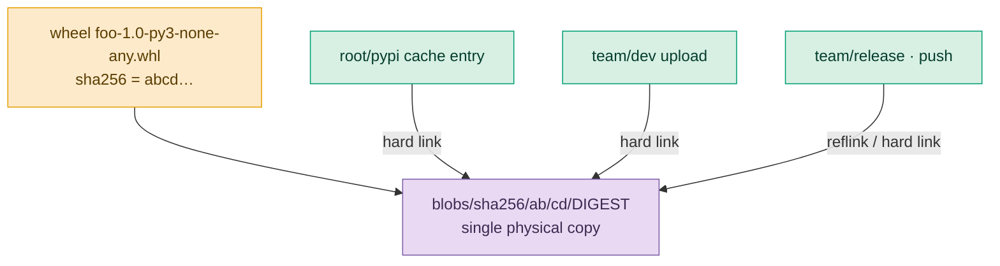
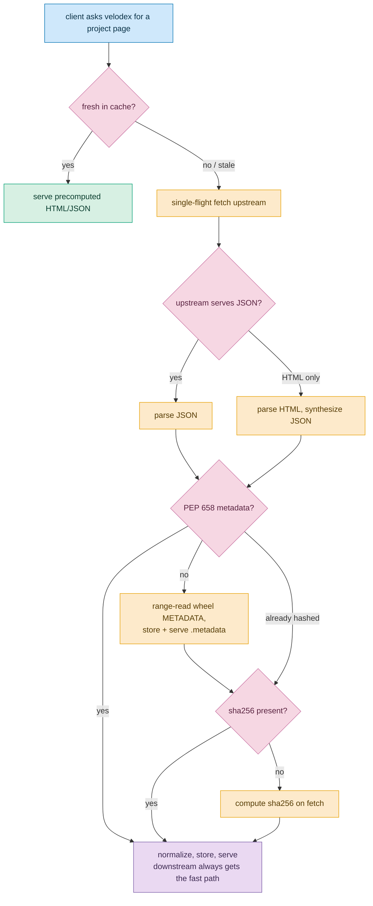

# velodex: design proposal

A PyPI-compatible read-through cache and private-index overlay, written in Rust for low resource use and high
throughput. velodex proxies and caches pypi.org (or any PEP 503 index), lets teams publish private packages into overlay
indexes that shadow the upstream mirror, and serves every modern Python packaging client (pip, uv, twine, Poetry, hatch,
flit) over the standard wire protocols.

devpi, Warehouse (pypi.org), and uv are the primary references for behavior. velodex is a clean-slate design, not a
port. Where devpi's architecture shows its age (Python per-request overhead, the bespoke keyfs changelog format, one
global write lock, the `--requests-only` worker split, pluggy on the hot path), velodex picks a simpler faster structure
and says so in [§14](#14-what-velodex-changes-vs-devpi).

## Contents

1. [Goals and non-goals](#1-goals-and-non-goals)
1. [Compatibility surface: standards and endpoints](#2-compatibility-surface-standards-and-endpoints)
1. [Architecture](#3-architecture)
1. [Index model: overlays and resolution order](#4-index-model-overlays-and-resolution-order)
1. [Storage and the filesystem cache](#5-storage-and-the-filesystem-cache)
1. [Upstream mirror adapter and graceful degradation](#6-upstream-mirror-adapter-and-graceful-degradation)
1. [HTTP API](#7-http-api)
1. [Upload: the standard protocol, no custom client](#8-upload-the-standard-protocol-no-custom-client)
1. [Authentication and authorization](#9-authentication-and-authorization)
1. [Web UI](#10-web-ui)
1. [Rust stack](#11-rust-stack)
1. [Distribution: pip-installable and self-contained](#12-distribution-pip-installable-and-self-contained)
1. [Testing and conformance](#13-testing-and-conformance)
1. [What velodex changes vs devpi](#14-what-velodex-changes-vs-devpi)
1. [Project conventions](#15-project-conventions)
1. [Roadmap](#16-roadmap)
1. [References](#17-references)

## 1. Goals and non-goals

### Goals

- **Zero-config read-through cache.** Run the binary, point pip/uv/twine at it, and it proxies and permanently caches
  pypi.org. Cached artifacts stay immutable and serve forever; only index pages revalidate. pypi.org is the default
  upstream; a TOML config file or CLI flags (with matching env vars, precedence defaults < file < env < flags) repoint
  the mirror at any other index instead, such as a private Artifactory or an internal devpi, and configure additional
  mirrors alongside it.
- **Private overlay indexes.** Teams publish private packages into indexes that inherit from the mirror and from each
  other. A locally published project shadows the upstream one, which gives dependency-confusion defense by default, as
  in devpi \[devpi model.py:1229 `sro()`\].
- **Standard protocols only.** velodex speaks the wire contracts pip/uv/twine already use against pypi.org and
  Artifactory. No velodex-specific client, no bespoke upload tool.
- **Full modern JSON APIs, not HTML-only.** velodex serves the complete JSON surface uv and pip prefer, not just a raw
  PEP 503 HTML index: PEP 691 JSON (`application/vnd.pypi.simple.v1+json`) with PEP 700 `versions`/`size`/`upload-time`,
  PEP 658/714 `.metadata`, PEP 592 yank, PEP 740 provenance and the integrity JSON, PEP 792 project status, and the
  legacy `/pypi/<project>/json` API. HTML is one negotiated format among these, not the only one. When an upstream
  serves only HTML, velodex parses it and synthesizes the JSON downstream
  ([§6](#6-upstream-mirror-adapter-and-graceful-degradation)), so clients always get the fast JSON path even behind a
  dumb index.
- **High speed, small footprint.** Async Rust, precomputed responses, content-addressed blob storage with copy-on-write
  dedup, a pure-Rust embedded metadata store, and an in-memory hot tier. Target: single-digit-millisecond cached
  responses and tens of MB RSS at idle.
- **Handles non-feature-complete upstreams.** Proxy Artifactory, Nexus, GitLab, CodeArtifact, Azure Artifacts, Google
  Artifact Registry, devpi, and plain static indexes. Most of these serve only PEP 503 HTML, so velodex probes
  capabilities and degrades gracefully, backfilling the PEP 658 metadata and sha256 hashes that upstreams omit
  ([§6](#6-upstream-mirror-adapter-and-graceful-degradation)).
- **pip/uv behavioral parity.** The acceptance bar: every pip/uv feature that works against pypi.org works against
  velodex, verified by a conformance harness ([§13](#13-testing-and-conformance)).
- **Ships like uv.** pip-installable from PyPI (maturin `bindings = "bin"`) and as self-contained static binaries via
  standalone installers ([§12](#12-distribution-pip-installable-and-self-contained)).

### Non-goals

velodex does not build these at all (as opposed to the phased plan, which delivers everything it lists):

- Sphinx documentation hosting and doc-zip serving (a devpi-web feature). The indexer trait seam covers full-text search
  of package metadata; hosting rendered Sphinx sites is out.
- `devpi test` / tox-result storage.
- PEP 694 Upload API 2.0 (draft, unimplemented anywhere), PEP 708 tracks (rejected), wheel-variant serving (PEP 817/825,
  draft). The filename and endpoint parsers tolerate these rather than implement them.
- A dynamic plugin system (pluggy/entry-points). velodex uses compile-time traits for the real extension seams (storage,
  auth, upstream adapter, indexer).
- Other package ecosystems (npm, crates, Maven, …). velodex implements only Python. Ecosystem-specific logic is
  namespaced under a `pypi` module (`velodex-core::pypi`) so another ecosystem could be added beside it later without
  reworking the dependent crates, but none is built now.

## 2. Compatibility surface: standards and endpoints

velodex implements the Simple Repository API as consolidated on packaging.python.org, with `meta.api-version` **1.1**
required and **1.4** as the ceiling it can advertise [Simple Repository API spec]. The wire contract comes byte-for-byte
from Warehouse [warehouse/api/simple.py, warehouse/packaging/utils.py], and the client expectations from pip
[pip/\_internal/index/collector.py] and uv [uv crates/uv-client].

### PEPs and specs

| Spec                                                  | Status          | velodex obligation                                                                                                                          |
| ----------------------------------------------------- | --------------- | ------------------------------------------------------------------------------------------------------------------------------------------- |
| **PEP 503** Simple HTML                               | Final           | Must. `/simple/`, `/simple/<name>/`, name normalization `re.sub(r"[-_.]+","-",name).lower()`, `#sha256=` fragments, `data-requires-python`. |
| **PEP 691** JSON Simple                               | Final           | Must. `application/vnd.pypi.simple.v1+json`, `Accept` negotiation, `Vary: Accept`.                                                          |
| **PEP 629** API versioning                            | Final           | Must. `meta.api-version`, `<meta name="pypi:repository-version">`.                                                                          |
| **PEP 700** size/upload-time/versions                 | Final           | Must. JSON `versions[]`, per-file `size`, `upload-time`.                                                                                    |
| **PEP 592** yank                                      | Final           | Must. `data-yanked` / `yanked`.                                                                                                             |
| **PEP 658 + 714** `.metadata`                         | Accepted        | Must (high value). Serve `{file}.metadata`; emit `core-metadata` plus legacy `data-dist-info-metadata`; backfill when upstream lacks it.    |
| **PEP 440** versions/specifiers                       | Final           | Must. Parse, normalize, sort, match. Reuse `pep440_rs`.                                                                                     |
| **PEP 508** requirements                              | Final           | Must (store/serve). Reuse `pep508_rs`.                                                                                                      |
| **PEP 427 / 425 / 600 / 656** wheel + tags            | Final           | Must. Parse wheel filenames and platform tags; validate on upload.                                                                          |
| **PEP 625** sdist naming                              | Accepted        | Must. Enforce `{name}-{version}.tar.gz` with `_`-normalized name.                                                                           |
| **Core Metadata 1.0–2.5** (PEP 566/643/639/685/753)   | Final           | Must. Accept the full `Metadata-Version` set 1.0–2.5; enforce License/License-Expression exclusivity (PEP 639); normalize extras (PEP 685). |
| **PEP 740** attestations/provenance                   | Final (API 1.3) | Must (Phase 5). Accept `attestations` on upload, serve `{file}.provenance` and `/integrity/.../provenance`.                                 |
| **PEP 792** project status                            | Final (API 1.4) | Must (Phase 5). `project-status` JSON key and meta; gate upload/download per status.                                                        |
| **PEP 694** Upload API 2.0                            | Draft           | Skip. Keep legacy `/legacy/`.                                                                                                               |
| **PEP 708** tracks                                    | Rejected        | Skip. Do not gate on API 1.2.                                                                                                               |
| PEP 817/825/777 wheel variants, PEP 819 JSON metadata | Draft           | Skip, tolerate. The filename and extension parser must not crash on `.whlx` or an extra filename component.                                 |
| PEP 751 lock file, PEP 766 index priority             | Final / Draft   | Client-side. No server work; serving PEP 691/700/658 well makes velodex a good lock source.                                                 |

### Endpoint matrix

Read endpoints follow Warehouse [warehouse/routes.py]; the write endpoint is the standard forklift contract
[warehouse/forklift/legacy.py].

| Path                                               | Method           | Content-Type                            | Spec                        | Status in velodex  |
| -------------------------------------------------- | ---------------- | --------------------------------------- | --------------------------- | ------------------ |
| `/{index}/simple/`                                 | GET              | html / `vnd.pypi.simple.v1+{html,json}` | 503/691/700                 | Required           |
| `/{index}/simple/{project}/`                       | GET              | same                                    | 503/691/700/592/658/714/792 | Required           |
| `/{index}/{file}` (blob)                           | GET/HEAD         | octet-stream, ranges                    | 503                         | Required           |
| `/{index}/{file}.metadata`                         | GET              | octet-stream                            | 658/714                     | Required (wheels)  |
| `/{index}/{file}.provenance`                       | GET              | json                                    | 740                         | Nice               |
| `/{index}/` (upload)                               | POST             | multipart to text                       | forklift                    | Required           |
| `/{index}/pypi/{project}/json`                     | GET              | json                                    | legacy JSON API             | Nice (widely used) |
| `/{index}/pypi/{project}/{version}/json`           | GET              | json                                    | legacy JSON API             | Nice               |
| `/integrity/{project}/{version}/{file}/provenance` | GET              | `vnd.pypi.integrity.v1+json`            | 740                         | Nice               |
| `/+api`, `/{index}/+api`                           | GET              | json                                    | discovery/capabilities      | Required           |
| `/+status`, `/metrics`                             | GET              | json / prometheus                       | health/obs                  | Required           |
| management API (index, user CRUD)                  | PUT/PATCH/DELETE | json                                    | velodex-specific            | Required           |

pypi.org exposes no machine API for account or index management, so that is the one place velodex designs its own
contract [warehouse management is web-UI plus CSRF only]. The contract stays small and REST-shaped ([§7](#7-http-api)).

The `X-PyPI-Last-Serial` header plus the XML-RPC `changelog_since_serial` method form the incremental-mirror contract
bandersnatch relies on [warehouse/legacy/api/xmlrpc]. velodex consumes them from upstream when present but does not
depend on them ([§6](#6-upstream-mirror-adapter-and-graceful-degradation)); velodex emits its own serial on its own
responses.

## 3. Architecture

One async process, `tokio` multi-thread runtime with a capped worker count, `axum` on `hyper` for HTTP. No GIL, no
thread-per-request pool, and no separate asyncio-loop bridge, all of which devpi carries \[devpi main.py XOM,
AsyncioLoopThread\].



The palette below is shared by every diagram: soft blue for clients, green for the HTTP and private-index layer, amber
for logic, purple for storage, rose for decisions and external services. The fills are pastel with dark text and the
hues follow the colorblind-safe Okabe-Ito set, so the diagrams stay legible in light and dark themes.

Layers:

- **HTTP.** Routing, content negotiation, range serving, compression (index pages only, never wheels), auth extraction,
  request tracing.
- **Index resolver.** The overlay/SRO engine ([§4](#4-index-model-overlays-and-resolution-order)). This is the domain
  logic worth taking from devpi, reimplemented cleanly.
- **Upload handler.** The standard forklift multipart protocol and its validation gauntlet
  ([§8](#8-upload-the-standard-protocol-no-custom-client)).
- **Upstream adapter.** A per-mirror capability descriptor, read-through fetch with single-flight coalescing, and
  graceful degradation ([§6](#6-upstream-mirror-adapter-and-graceful-degradation)).
- **Storage.** redb for metadata and an ordered serial log, a content-addressed blob store on the filesystem, and moka
  for the RAM hot tier ([§5](#5-storage-and-the-filesystem-cache)).

Extension seams are compile-time traits, not a runtime plugin system: `Storage`, `Authenticator`, `UpstreamAdapter`,
`Indexer`. Most of what devpi implements as pluggy hooks is core in velodex and monomorphized.

### Project layout

A Cargo workspace with one crate per concern, layered so dependencies point one way (bin to http to upstream to storage
to core to types). The pure crates carry no I/O and unit-test in isolation, which keeps the 100% coverage gate cheap to
hold.

```
velodex/
  Cargo.toml                 # workspace, [workspace.lints], [workspace.dependencies]
  rust-toolchain.toml        # stable 1.93.x
  .rustfmt.toml              # max_width = 120
  crates/
    velodex-types/             # newtypes (PackageName, Version, Serial, IndexId) + serde wire structs; no logic
    velodex-core/              # domain: index model, SRO, allow-list, PEP 440/508, wheel/sdist parsing,
                             #   core-metadata validation. Pure, no I/O. The bulk of the unit tests.
    velodex-storage/           # redb metadata + serial log, blob CAS, reflink/hardlink dedup, moka tier,
                             #   eviction/GC, fsck, crash recovery. Depends on core + types.
    velodex-upstream/          # reqwest client, capability probe + descriptor, degradation, PEP 658/hash
                             #   backfill, per-upstream auth + token refresh. Depends on core + storage.
    velodex-http/              # axum app: simple API (HTML/JSON), blob serving, forklift upload, mgmt API,
                             #   /+api, /+status, /metrics, auth extraction, embedded static assets.
    velodex-web/               # Leptos CSR frontend (WASM); built with trunk, output embedded via rust-embed
    velodex/                   # binary: clap CLI (serve/init/cache/fsck/config-snippet), config, tracing, wiring
  python/velodex/              # maturin launcher: __main__.py, _find_velodex.py
  pyproject.toml             # maturin bindings = "bin"
  dist-workspace.toml        # cargo-dist installers
  .github/workflows/         # per-crate path-filtered CI + release
```

Each crate owns its `src/tests/<module>_tests.rs`. `velodex-core` has no dependency on tokio, axum, or redb, so its
version/name/metadata logic tests run fast and deterministically.

## 4. Index model: overlays and resolution order

The overlay system is velodex's reason to exist beyond a dumb cache. It follows devpi's model \[devpi model.py,
mirror.py\] with a cleaner implementation.

### Index kinds

- **Mirror index.** A read-only caching proxy to an upstream PEP 503/691 index. `root/pypi` mirrors
  `https://pypi.org/simple/`, created on init \[devpi main.py:776 `_pypi_ixconfig_default`\]. You can configure any
  number of extra mirrors: a private Artifactory, an internal devpi, piwheels.
- **Private index.** Read/write, owned by a user, publishable via the standard upload protocol. It has `bases` (a list
  of parent indexes) and a `volatile` flag.

### Bases and stage resolution order (SRO)

An index resolves a project by walking its stage resolution order, modeled on Python's MRO \[devpi glossary "sro"\]:
breadth-first over non-mirror bases, deduped, with all mirror bases yielded last \[devpi model.py:1229 `sro()`\]. Two
consequences follow:

- A private file shadows an upstream file of the same name, which gives the dependency-confusion defense on by default.
- `get_simplelinks(project)` merges files across the SRO, first-wins by filename, then sorts newest-first by
  `(version, name, ext)` [devpi model.py:1032].



### Mirror allow-list

Once a project is published privately, upstream versions of that name stay hidden unless the name is allow-listed
(`mirror_whitelist` in devpi; velodex calls it `allow_upstream`) \[devpi model.py:1177
`op_sro_check_mirror_whitelist`\]. velodex copies this inverted default because it is the security-critical behavior.

### Volatile vs non-volatile

- **Non-volatile** (default for `root/pypi`, recommended for release indexes): files stay immutable. Re-uploading an
  existing filename with identical content returns a 200 no-op; different content returns a 409 \[warehouse
  forklift/legacy.py duplicate handling\].
- **Volatile** (dev indexes): overwrite allowed, logged.

### Promotion

`push` copies a release (files plus metadata) from one index to another without a rebuild \[devpi views.py
`_push_links`\]. Because blobs are content-addressed, promotion is a zero-byte copy-on-write clone
([§5](#5-storage-and-the-filesystem-cache)). Pushing to an external real PyPI is a re-upload over the standard protocol,
so velodex exposes it as a server-side action that POSTs to a configured upstream's `/legacy/`.

## 5. Storage and the filesystem cache

The defining pattern, which devpi's filestore and uv's cache reached independently: immutable content-addressed blobs,
small versioned control records, atomic temp-rename, and single-flight read-through. Control metadata and blob bytes
split apart. redb stays authoritative for what exists and its hash; the filesystem holds bytes \[devpi filestore_fs.py
vs filestore_db.py; uv crates/uv-cache\].

### On-disk layout

Everything sits under one `VELODEX_DATA_DIR` on a single filesystem, because reflink/hardlink dedup and atomic rename
require it. velodex checks this at startup by comparing device ids.

```
<root>/
  CACHEDIR.TAG                    # uv does this: crates/uv-cache/src/lib.rs
  velodex.redb                      # control DB: metadata, etags, serials, blob refcounts
  velodex.lock                      # process-wide advisory lock (fs4)
  blobs/sha256/<ab>/<cd>/<64hex>  # content-addressed immutable CAS, 2-level fan-out
  index/<index-id>/<pkg>.rkyv     # cached upstream simple-index records (+ HTTP policy)
  uploads/<user>/<index>/+f/...   # private uploads (durable), hard-linked into blobs/
  tmp/                            # staging for atomic writes + orphan recovery
```

Blob sharding uses 2 levels of 2 hex chars (65,536 leaf dirs); 10M blobs give roughly 150 files per leaf, well under any
directory cliff [devpi filestore.py:418 uses 3 chars for the same reason; uv and cacache shard similarly]. The full
64-hex digest is the filename, so the path is the integrity proof.

### Content addressing and copy-on-write dedup

`blobs/sha256/<ab>/<cd>/<digest>` is the single physical copy of any artifact. Every other reference (a mirror cache
entry, a private upload, a `push` target, an overlay member) is a link to that inode \[devpi filestore_hash_hl.py
hard-link dedup\].

- **Primary mechanism: hard links.** Blobs stay immutable, so shared-inode semantics are safe and cost zero bytes. redb
  tracks refcounts explicitly (a referrer set per digest) rather than reading `st_nlink`, so refcounting survives
  reflink and encodes the durable-vs-evictable distinction.
- **Copy-on-write reflinks** (`reflink-copy`, maintained by the Cargo team) cover what hard links cannot: materializing
  a blob across a subtree, or cloning on a filesystem that supports it (APFS, btrfs, XFS reflink, ZFS, ReFS). The
  fallback chain runs reflink, then hardlink, then copy, matching uv's link strategy [uv crates/uv-fs/src/link.rs].
- **`push` and overlay materialization are O(1) zero-byte clones**, a new directory entry linked to the existing inode.
  One cached wheel serves the mirror and every private index that references it.



redb itself is a copy-on-write B-tree with MVCC [redb design], so snapshot-isolation-at-a-serial comes for free. devpi
hand-builds that property in keyfs.

### Crash safety

The write recipe: stream to `tmp/<unique>-tmp`, hash while streaming, verify the digest before commit, `fsync` the file,
atomic-rename into `blobs/`, `fsync` the parent dir. A truncated download only ever exists under the temp name and never
gets renamed in unless the hash matches, so anything in `blobs/` is complete and correct by construction \[devpi
DirtyFile.commit, filestore_fs.py:85-98\].

- **Mirror recovery.** Sweep orphan `tmp/` files at startup. Re-fetch on miss is always safe, so cached content needs no
  changelog replay, a large simplification over devpi's `rel_renames` machinery \[devpi filestore_fs_base.py:226
  `perform_crash_recovery`\].
- **Durable-upload recovery.** The rename intent goes into the redb transaction alongside the metadata and replays at
  startup. This is the one place velodex keeps devpi's rigor, because uploads cannot be re-fetched.

### Read-through revalidation

- **Immutable blobs** (wheels, sdists, `.metadata`): fetch once, serve forever,
  `Cache-Control: immutable, max-age=<large>`. Never revalidate.
- **Mutable simple-index pages**: RFC 9111 freshness via `http-cache-semantics`. Fresh serves from cache with no
  network. Stale sends conditional `If-None-Match` (strong ETags only, matching uv [uv httpcache/mod.rs:500]) or
  `If-Modified-Since`; a 304 refreshes the policy without rewriting the body. No cache headers caps freshness at 600s
  (uv's heuristic mirroring PyPI's `max-age=600`); nothing at all revalidates every fetch. velodex reads
  `X-PyPI-Last-Serial` as a cheap change-detector when upstream provides it and never depends on it.
- **Serve-stale-on-error.** Upstream 5xx or unreachable plus a stale entry serves stale (RFC 5861). velodex favors
  availability over freshness, as devpi does [devpi mirror.py].

### Concurrency and coalescing

- **Single-flight fetch.** N concurrent misses for one URL trigger one upstream fetch, via moka `try_get_with` for
  cached results and a `dashmap<Key, Arc<Mutex<()>>>` of per-key async locks for streamed blobs \[devpi's
  WeakValueDictionary of per-project locks maps directly\]. velodex never holds a lock across an unrelated `.await`.
- **Streaming tee.** Bytes from upstream fan out to the client response, the sha256 hasher, and the temp file in one
  pass, so one network read serves the client and warms the cache.
- **Single-writer metadata.** redb's MVCC gives one writer and many readers with no global mutex. This replaces devpi's
  global write lock and removes the reason for its `--requests-only` worker split.

### Eviction, GC, quotas

Two populations, opposite policies:

- **Mirror cache** (blobs reachable only from mirror records): prunable, size-capped LRU under a disk quota, tracked in
  redb.
- **Private uploads:** never evicted.

A blob shared by both stays pinned by its redb referrer set, so eviction candidates are blobs with only mirror
referrers. `velodex cache gc|prune|clean` runs under an exclusive file lock, modeled on uv's `prune`/`clear` \[uv
crates/uv-cache/src/lib.rs\]. `velodex fsck` recomputes digests and reconciles redb referrers against the filesystem.

### nginx offload

The blob path stays reverse-proxy-friendly: a front nginx can `try_files` into `blobs/sha256/...` or use
`X-Accel-Redirect` to serve wheel bytes in kernel space, leaving velodex to handle index pages and revalidation \[devpi
ships an nginx caching config for this\]. This is the highest-leverage throughput move, designed in from day one.

## 6. Upstream mirror adapter and graceful degradation

Most upstreams are not feature-complete. The confirmed picture (primary-source vendor docs plus pip/uv issue trackers):

| Capability           | pypi.org | Artifactory    | Nexus ≥3.94 | GitLab     | CodeArtifact | Azure     | Google AR | devpi  | static  |
| -------------------- | -------- | -------------- | ----------- | ---------- | ------------ | --------- | --------- | ------ | ------- |
| PEP 691 JSON         | yes      | opt-in         | yes         | no         | no           | no        | no        | yes    | some    |
| PEP 658 metadata     | yes      | no             | yes         | no         | no           | no        | no        | opt-in | some    |
| Hashes (sha256)      | always   | varies         | yes         | in-path    | varies       | varies    | varies    | yes    | yes     |
| Name normalization   | strict   | off by default | yes         | aggressive | yes          | pip-side  | pip-side  | yes    | varies  |
| Full `/simple/` list | yes      | varies         | yes         | no         | no           | feed-only | gated     | yes    | some    |
| PEP 700 fields       | yes      | no             | yes         | no         | no           | no        | ?         | ~      | no      |
| `X-PyPI-Last-Serial` | yes      | no             | no          | no         | no           | no        | no        | own    | no      |
| Conditional GET      | yes      | ?              | ?           | ?          | ?            | ?         | ?         | ~      | web-dep |

Sources: JFrog PyPI docs (JSON is opt-in via "Enable simple json format", normalization off by default so `jfrog.pypi`
differs from `jfrog_pypi`), GitLab PyPI docs (HTML-only, aggressive normalization, request-forwarding on by default),
AWS CodeArtifact docs (12h STS token, mandatory trailing slash, no full project list), Nexus 3.93/3.94 release notes,
uv#14375/#10394/#11899, pip#11490.

### Upstream capability descriptor

Per configured upstream, velodex holds a descriptor populated by a cheap probe at first use (cached, TTL-revalidated),
then corrected by real responses:

```rust
struct UpstreamDescriptor {
    base_url: Url,
    url_layout: UrlLayout,           // PyPISimple | Artifactory{repo} | Nexus{repo}
                                     // | GitLab{project|group} | CodeArtifact{..} | Azure{..}
                                     // | GoogleAR{..} | Devpi{user,index} | StaticBase
    name_normalization: Normalization,        // Strict | Off | Aggressive
    auth: AuthKind,
    has_json_api: Option<bool>,      // PEP 691 honored, exact media type
    has_pep658: Option<bool>,
    hash_algos: HashSupport,         // Sha256Always | Sha256Sometimes | Md5Only | None
    has_pep700: Option<bool>,
    has_yanked: Option<bool>,
    has_serial: Option<bool>,        // X-PyPI-Last-Serial
    supports_conditional_get: Option<bool>,
    supports_project_list: Option<bool>,
    requires_trailing_slash: bool,
    returns_200_html_on_missing: bool,        // the pip#11490 hazard
    redirects_to_foreign_host: bool,          // re-attach auth on download redirect
}
```

The probe is one project-page GET (`Accept: …+json, text/html;q=0.5`), one root GET, and one guaranteed-absent-project
GET. velodex derives every field from those. Unknown fields get treated conservatively.

### Degradation strategy



This mirrors the fallbacks pip and uv already ship \[uv registry_client.rs:900-906, pip prepare.py:370-457\]:

| Missing upstream capability | velodex behavior                                                                                                                                                                                                                                                                                                                                                           |
| --------------------------- | -------------------------------------------------------------------------------------------------------------------------------------------------------------------------------------------------------------------------------------------------------------------------------------------------------------------------------------------------------------------------- |
| No PEP 691 JSON             | Parse upstream HTML (PEP 503), build the internal model, synthesize JSON downstream.                                                                                                                                                                                                                                                                                       |
| No PEP 658 `.metadata`      | On first wheel fetch, range-read the wheel (last ~16 KiB central directory, then the `METADATA` member, `Accept-Encoding: identity`, at most two range GETs) or full-download; extract `METADATA`, store it, serve `{file}.metadata`, advertise `core-metadata` with its sha256. Both clients do this; velodex does it once so every downstream client gets the fast path. |
| No hashes / md5-only        | Compute sha256 on first fetch (velodex is content-addressed anyway); never propagate md5-only.                                                                                                                                                                                                                                                                             |
| No PEP 700 fields           | Synthesize `size` from the stored blob and `versions` from the file list; omit `upload-time`, and document that `--exclude-newer` will not work for that upstream (uv#10394).                                                                                                                                                                                              |
| No serial                   | Time-based TTL plus conditional GET.                                                                                                                                                                                                                                                                                                                                       |
| No conditional GET          | TTL-only revalidation.                                                                                                                                                                                                                                                                                                                                                     |
| No full project list        | velodex's own `/simple/` lists only observed/cached projects; the upstream is marked non-enumerable.                                                                                                                                                                                                                                                                       |
| Has serial                  | Adopt bandersnatch's model: reject responses whose serial regressed, which defeats stale CDN reads.                                                                                                                                                                                                                                                                        |

### Not reproducing client-breaking bugs

velodex's own responses avoid the failure modes that break real clients \[pip#11490, uv#14375/#1754/#5595/#5600/#7273\]:
404 with no body for missing projects (never 200-HTML), accurate `Content-Type` with no spurious 406 or charset
rejection, name normalization with a 301 redirect, same-origin download URLs (or re-attached auth on redirect), sha256
always (never md5-only), auth honored across redirects, and both trailing-slash forms tolerated.

## 7. HTTP API

`axum` handlers, `tower-http` for compression/trace/timeout/limits, streaming file bodies via
`tokio_util::io::ReaderStream` with range support. velodex precomputes responses at index-update time. The PEP 503 HTML
and PEP 691 JSON for a project get serialized once and served as bytes, never rendered per request \[Warehouse renders
and stores simple detail as a static file for the CDN; same idea\].

### Two audiences on one URL

The same index and project URLs serve a person and a tool differently. velodex negotiates on both `Accept` and
`User-Agent`, and sets `Vary: Accept, User-Agent` so caches keep the variants apart (devpi does the same with its
UA-gated installer routes \[devpi views.py `installer_simple`\]; Warehouse varies on Accept).

- **A tool** (uv, pip, twine, Poetry, pdm, pex, or any client sending
  `Accept: application/vnd.pypi.simple.v1+json`/`+html`, or a known installer `User-Agent`, or plain `curl`) gets the
  machine index: PEP 691 JSON when acceptable, otherwise the minimal PEP 503 `v1+html`. Both are precomputed and served
  as bytes, and both go out gzip/zstd-compressed via the `tower-http` compression layer, which shrinks the highly
  repetitive anchor/JSON list to a fraction of its size. Compression applies to index pages only, never to wheels.
- **A browser** (an `Accept` led by `text/html` with a browser `User-Agent`, and no simple media type) gets the readable
  view: velodex returns the Leptos web UI shell for that index or project ([§10](#10-web-ui)), which renders a styled,
  human page against the JSON API. The raw anchor list never reaches a person unless they ask for it.

For tool requests the offer order follows Warehouse (`vnd.pypi.simple.v1+json`, `vnd.pypi.simple.v1+html`, `text/html`);
an unmatchable `Accept` falls back to the machine HTML rather than 406 (the simple API does not 406; the integrity API
does) [warehouse api/simple.py:23-48].

### Management API (velodex-specific)

The one surface with no pypi.org precedent. Small, REST-shaped, token-authenticated:

- `PUT /{user}/{index}` creates an index (`bases`, `volatile`, `allow_upstream`, `mirror_url`).
- `PATCH /{user}/{index}` modifies it (JSON, or `key+=val` / `key-=val` list ops as devpi does).
- `DELETE /{user}/{index}` is refused on non-volatile indexes unless forced.
- `PUT/PATCH/DELETE /{user}` manages users.
- `GET /+api`, `GET /{index}/+api` return discovery: the index/simple/upload URLs and a capability list, so clients and
  tooling negotiate without version sniffing \[devpi `/+api` feature negotiation, a pattern worth keeping\].

`velodex config-snippet` prints ready `.pypirc` / `pip.conf` / `uv` config pointing at an index (the JFrog "Set Me Up"
and devpi `use --set-cfg` pattern), a convenience emitter rather than a stateful client.

## 8. Upload: the standard protocol, no custom client

velodex writes no uploader. It accepts the standard PyPI upload protocol, so `twine`, `uv publish`, `flit publish`,
`hatch publish`, and Poetry all work unmodified; the user only changes the repository URL. There is no velodex
equivalent of `devpi upload`.

The endpoint is the forklift contract \[warehouse/forklift/legacy.py\]: `POST /{index}/` with `multipart/form-data`,
dispatched on the `:action=file_upload` field, `protocol_version=1`. Accepted fields and validation match Warehouse so
client error messages line up:

- **Fields:** `name`, `version`, `filetype` (`sdist|bdist_wheel`), `pyversion`, `metadata_version`, `content` (the
  file), `sha256_digest` / `blake2_256_digest` / `md5_digest` (at least one), `attestations` (optional, PEP 740), plus
  all core-metadata fields.
- **Validation gauntlet** (in order, each a clean 4xx with a client-readable body): protocol version; project-name regex
  `^([A-Z0-9]|[A-Z0-9][A-Z0-9._-]*[A-Z0-9])$`; metadata parse and validate against `Metadata-Version ∈ {1.0…2.5}`,
  License/License-Expression exclusivity (PEP 639), classifier validity; permission check; filename validation
  (extension matches filetype, no control chars, PEP 625 sdist form, PEP 427 wheel form, name/version match metadata);
  single-pass sha256+blake2b hashing with size limits; digest verification via constant-time compare; duplicate handling
  (identical returns a 200 no-op with a doomed transaction, different content returns a 400 whose body must start with
  `"File already exists"` because twine `--skip-existing` keys on that prefix); archive validity (real zip/tar, zip-bomb
  ratio cap 50x over 64 MiB, allowed compression only, PKG-INFO/WHEEL presence, RECORD and entry-points validation);
  METADATA extraction stored as the PEP 658 `.metadata` sibling.
- **Content-addressed storage.** The blob gets keyed by digest and written per
  [§5](#5-storage-and-the-filesystem-cache), so a private upload that duplicates a cached wheel costs zero extra bytes.

velodex takes Warehouse's blake2b-256 path layout, single-pass triple hashing, and idempotent-reupload semantics
verbatim [warehouse/forklift/legacy.py:1082-1186, 1558-1585].

## 9. Authentication and authorization

Standard mechanisms only, so existing client configs work against velodex after a URL change. velodex accepts, over the
read and upload paths:

- **pypi.org token auth.** HTTP Basic with username `__token__` and an API token as the password \[warehouse
  macaroons/security_policy.py\]. velodex issues its own tokens (opaque, scoped, optionally expiring); it does not
  require macaroons.
- **Artifactory-style auth.** Basic username/password, and Bearer access/identity tokens [JFrog access-token docs]. A
  client already pointed at Artifactory authenticates against velodex unchanged.
- **Basic username/password** for velodex-native users.
- **`.netrc`, URL-embedded credentials, keyring** stay client-side and work transparently, because velodex sees only the
  resulting Basic/Bearer header.

Auth is a compile-time `Authenticator` trait over a stable `credentials → Identity{user, groups}` contract \[devpi's
pluggable credential extraction, minus pluggy\]. LDAP/OIDC/external auth are future trait impls, not v1.

Upstream auth (velodex to a private mirror) is configured per upstream and covers the spread found in the wild: static
Basic/Bearer, and rotating tokens with a refresh scheduler keyed off an expiry timestamp for CodeArtifact (12h STS
token, username `aws`, re-minted via SigV4), Google AR (`oauth2accesstoken`, ~1h), and Azure credprovider JWT
([§6](#6-upstream-mirror-adapter-and-graceful-degradation) descriptor `AuthKind`).

Authorization is per-index ACLs as pure data, first-match allow/deny [devpi view_auth.py]. Principals: `everyone`,
`authenticated`, `<user>`, `:<group>`, with special `:ANONYMOUS:` and `:AUTHENTICATED:`. Per-index `acl_upload` controls
publish. Read defaults to public but is a first-class per-index option, so velodex builds in what devpi bolts on via
devpi-lockdown. `--restrict-modify` narrows who can create or modify users and indexes.

Passwords hash with `argon2` (Argon2id); tokens compare in constant time (`subtle`).

## 10. Web UI

A modern reactive single-page app written in Rust with **Leptos** (client-side rendering), compiled to WebAssembly with
**trunk**. The whole frontend stays in the cargo toolchain, so velodex builds with `cargo` plus `trunk` and never pulls
in Node, npm, or vite. This keeps the self-contained, no-foreign-deps ethos while giving a genuinely modern static site.

- **Static output, embedded.** trunk builds `crates/velodex-web` to a hashed `index.html` + `<hash>.wasm` + JS glue +
  CSS. `rust-embed` bakes those assets into the binary; velodex-http serves them as static files with immutable
  long-cache headers (the hashed filenames make that safe). The WASM loads once and caches; there is no per-request
  server render.
- **Data over the JSON API.** The app is a client of velodex's own JSON: the PEP 691 simple JSON plus a small read-only
  UI API (index list, index detail, project and version views, search results). Payloads are small JSON, so pages are
  fast and the same data powers the CLI clients.
- **Pages:** index list, index detail (bases, ACL, allow-list, package table), project (versions across the SRO),
  version (metadata, file list, rendered README), search, and `/+status`. Client-side routing.
- **README rendering** happens server-side (`pulldown-cmark` for Markdown, sanitized with `ammonia`) and ships as
  sanitized HTML in the JSON API, so the WASM client stays small and no renderer runs in the browser.
- **Styling** is Pico.css classless (vendored) plus a little hand-written CSS. No Tailwind, no CSS build step, no Node.
- **Search** runs on Tantivy behind the `Indexer` trait seam (Phase 5). Hosting rendered Sphinx sites stays out of
  scope.

uv and ruff ship no web UI, so there is no Astral precedent; devpi-web is the behavioral reference and velodex
reimplements a leaner version of it in Rust.

## 11. Rust stack

All pure-Rust except optional components, so static musl binaries stay clean with no OpenSSL, no RocksDB, no C++. The
choices track what uv/ruff ship.

```toml
# HTTP server / runtime
axum        = { version = "0.8", features = ["http2"] }
tower-http  = { version = "0.7", features = ["compression-full","trace","timeout","fs","limit","set-header"] }
tokio       = { version = "1", features = ["full"] }       # multi_thread, worker_threads = min(cores, 4)
tokio-util  = { version = "0.7", features = ["io"] }

# HTTP client (proxy/mirror)
reqwest             = { version = "0.13", default-features = false, features = ["rustls-tls","http2","stream","gzip","zstd","blocking"] }
rustls-platform-verifier = "*"                             # OS trust store, like uv
reqwest-middleware  = "0.5"
reqwest-retry       = "0.9"
http-cache-semantics = "3"                                 # RFC 9111 freshness

# storage / serialization
redb        = "4"                                          # metadata + serial log + cache index
reflink-copy = "0.1"                                       # CoW dedup, Cargo-team crate
serde       = { version = "1", features = ["derive"] }
serde_json  = "1"                                          # PEP 691, precomputed
rkyv        = "0.8"                                        # zero-copy hot-path records (uv-style)
postcard    = "1"                                          # internal binary records

# python packaging (reuse, don't reinvent)
pep440_rs      = "0.7"                                     # PEP 440 versions/specifiers
pep508_rs      = "0.9"                                     # PEP 508 requirements
python-pkginfo = "0.6"                                     # METADATA/PKG-INFO parsing (maturin uses it)
# vendor uv-distribution-filename for wheel/sdist parsing; reimplement PEP 503 normalization

# web UI (crates/velodex-web, WASM target, built with trunk — no Node)
leptos      = { version = "0.7", features = ["csr"] }      # Rust/WASM reactive SPA
rust-embed  = { version = "8", features = ["compression"] } # embed the built static assets
pulldown-cmark = "0.12"                                     # server-side README render (Markdown)
ammonia     = "4"                                           # sanitize rendered HTML

# CLI / config / observability
clap   = { version = "4", features = ["derive","env","wrap_help"] }
config = "0.15"
tracing = "0.1"; tracing-subscriber = { version = "0.3", features = ["env-filter","json"] }
tracing-appender = "0.2"                                   # non-blocking rolling log file
tracing-journald = "0.3"                                   # systemd journal sink
syslog-tracing   = "0.3"                                   # classic syslog sink
metrics = "0.24"; metrics-exporter-prometheus = "0.18"

# crypto / concurrency / misc
sha2 = "0.11"; blake3 = "1"; subtle = "2"; argon2 = "0.5"; foldhash = "0.2"
moka = { version = "0.12", features = ["future"] }         # single-flight + TinyLFU hot cache
dashmap = "6"; arc-swap = "1"; parking_lot = "0.12"
thiserror = "2"; anyhow = "1"; color-eyre = "0.6"
jiff = "0.2"; uuid = { version = "1", features = ["v4","v7","serde"] }; bytes = "1"
fs4 = "0.9"                                                # multi-process advisory locks
mime = "0.3"; async-compression = { version = "0.4", features = ["tokio","gzip","zstd"] }; tempfile = "3"

[dev-dependencies]
rstest = "0.26"; insta = "1"; wiremock = "0.6"; proptest = "1"
```

Rationale: axum/tower/tokio is the tokio-rs serving trio; reqwest with rustls and reqwest-retry is uv's verified proxy
stack; redb is the one pure-Rust crash-safe store covering read-heavy index serving, the append-only serial log, and the
HTTP cache index; rkyv for zero-copy hot records is uv's design; moka `get_with` gives request coalescing; pep440_rs and
pep508_rs are semver-stable over a frozen spec, so reuse is safe. velodex vendors wheel/sdist filename parsing from uv
(no good standalone crate) and patches its imports to the standalone pep440/pep508 crates so types unify. Release builds
at `opt-level=3` because sha2's soft backend needs it.

### Logging and observability

velodex logs through `tracing` with structured, leveled events and per-request spans (a `request_id`, the index, the
package), so behaviour is debuggable in production. The level comes from `tracing-subscriber`'s `EnvFilter`, set by
`RUST_LOG`/`VELODEX_LOG` or `--log-level {error,warn,info,debug,trace}` and overridable per module (for example
`velodex_upstream=debug`), so an operator raises verbosity for one subsystem without a rebuild or restart-wide noise.
Output routes to one or more sinks, selected by TOML/CLI/env: stdout (pretty for a TTY, JSON for log aggregation), a
rolling log file (`tracing-appender`, non-blocking, daily or size rotation), and the system log via `tracing-journald`
(systemd journal) or `syslog-tracing` (classic syslog). Metrics run alongside on the `metrics` facade with a Prometheus
exporter at `/metrics`. The CLI carries a `--verbose`/`-v` shortcut that bumps the level for quick local debugging.

## 12. Distribution: pip-installable and self-contained

velodex ships the same binary through the channels uv uses, from one build \[uv pyproject.toml, dist-workspace.toml,
.github/workflows/build-release-binaries.yml\]. Every build first runs `trunk build --release` for `crates/velodex-web`
so the WASM/HTML/CSS assets exist for `rust-embed` to bake in; both trunk and cargo come from the Rust toolchain, so the
pipeline adds no Node.

### PyPI wheels (maturin `bindings = "bin"`)

A root `pyproject.toml` with `build-backend = "maturin"`, `[tool.maturin] bindings = "bin"`, `manifest-path` pointing at
the `velodex` crate, and `python-source = "python"`. This produces fat per-platform wheels: the native binary lands in
the wheel's `scripts/` dir, so `pip install velodex` and `uv tool install velodex` put `velodex` on PATH, and a small
`python/velodex/` launcher (`__main__.py` plus `_find_velodex.py`) makes `python -m velodex` work [uv python/uv/\*]. CI
matrix: manylinux2014, musllinux_1_1, macOS x86_64 and aarch64, windows msvc, always `--compatibility pypi`, each wheel
smoke-tested with `pip install --no-index --find-links`. PyPI publish uses Trusted Publishing (OIDC): `id-token: write`,
no stored token.

### Standalone installers and archives

`cargo-dist` (`dist`) with `installers = ["shell","powershell"]` and `build-local-artifacts = false` pointing at the
same build workflow, so wheels and tarballs come from one pass. Static linking uses MSVC `+crt-static` and musl
`+crt-static`; the glibc floor pins to 2.17 via manylinux2014. Extra channels: Homebrew, `cargo install`, and a
`FROM scratch` Docker image cross-compiled to musl via `cargo-zigbuild`.

### Profiles and versioning

```toml
[profile.release]
strip = true
lto = "fat"
# opt-level defaults to 3 (needed by sha2); codegen-units left default for build speed
```

The crate version in `Cargo.toml` is canonical, surfaced at runtime via `env!("CARGO_PKG_VERSION")`. A release script
bumps `pyproject.toml` and the Cargo manifests together [uv rooster / bump-workspace-crate-versions.py].

## 13. Testing and conformance

velodex runs a layered test suite through `cargo nextest` (one process per test, scheduled in parallel across binaries;
the integration tests share a single binary to keep link time down). Coverage runs through `cargo llvm-cov` and gates at
**100% lines and functions**. Region and branch coverage is reported but not gated: it counts compiler- and
macro-generated branches (`tracing` expansions, drop glue, panic edges) that no test reaches on stable, and the
entrypoint shell (`main.rs`) is excluded. This matches the practice of cargo-llvm-cov, tokio, and nextest.

The layers, fast to slow:

- **Unit.** Pure domain (PEP 440/508, PEP 503 normalization, filename parsing) with tests in
  `src/tests/<module>_tests.rs`, `proptest` for round-trip/idempotence/ordering invariants plus the PyPA corpus as fixed
  cases, and `insta` snapshots that pin byte-for-byte PEP 503 HTML and PEP 691 JSON.
- **Integration.** axum handlers driven through `tower`'s `oneshot` with no socket, real `redb` in a `tempfile`
  directory, and `wiremock` upstreams for the degraded modes (HTML-only, no hashes, no PEP 658, 200-HTML-on-404,
  auth-dropping redirects, ETag/304, timeouts). A real ephemeral port is used only for range requests and
  redirect-follow. Single-flight is asserted with `wiremock`'s `.expect(1)` under concurrent load, and TTL/staleness
  with `tokio`'s paused clock.
- **End-to-end.** Real `pip`/`uv`/`twine` driven by `assert_cmd` against a running velodex whose upstream is an
  in-process mock that synthesizes tiny wheels and sdists in memory (uv's own model), with pinned upload times for
  deterministic snapshots.
- **Fuzz.** `cargo-fuzz` targets for the multipart upload parser, the wheel/zip archive validator (zip bombs, path
  traversal, malformed `RECORD`), and the version/specifier/filename parsers.

The fast lint-and-unit job blocks every other job; e2e and container tests run in a gated CI job, sharded with nextest.

### Conformance harness: the real acceptance bar

Every pip/uv feature that works against pypi.org works against velodex. No official Simple API conformance suite exists,
so velodex builds its own, modeled on `packse` [uv's resolver test tool].

- **Tier A, synthetic and deterministic.** Generate packages from declarative scenarios, serve them through velodex,
  drive real `pip` and `uv` CLIs in throwaway venvs, and assert identical resolution (versions, selected filenames,
  hashes). Scenarios: pure-Python trees; manylinux/musllinux C-extension wheels (numpy, cryptography, pydantic-core) for
  tag selection; sdists that build; extras and environment markers; `requires-python` filtering; yanked handling (skip
  unless only match or pinned); `--require-hashes`; constraints/overrides; PEP 658 metadata-only resolution (assert the
  served `.metadata` bytes hash-match the wheel); `uv lock` plus `uv sync --locked` reproducibility; `--index-url` vs
  `--extra-index-url` and uv index priority, including the dependency-confusion no-fallthrough case.
- **Tier B, golden baseline vs pypi.org.** For a curated project set, snapshot the real `pypi.org/simple/<project>/`
  JSON keyed by its `_last-serial`, then assert velodex's output matches modulo URL-host rewriting and `.metadata`
  backfill. Pinning to a serial makes the diff deterministic despite CDN caching.
- **Regression guards from real client bugs.** Missing project returns 404-no-body (pip#11490); correct `Content-Type`
  with no spurious 406 (uv#14375) or charset rejection (uv#1754); auth re-attached across redirects (uv#5595) and reused
  on the download URL (uv#5600); name-normalization redirect; trailing-slash tolerance both ways; an empty or group
  index does not cause early-exit (uv#7273).
- **Upstream degradation tests.** Spin up a no-PEP-658 upstream and confirm velodex synthesizes `.metadata` whose hash
  matches the wheel METADATA; a no-hash upstream, and confirm sha256 is computed and stable; a no-serial upstream, and
  confirm TTL revalidation fires; the capability probe detects each.

### Final validation: devpi vs velodex

The release bar is a side-by-side against devpi, the closest existing tool. A harness bootstraps both a devpi server and
velodex pointed at the same upstream, then runs one integration workload against each: install a set of popular PyPI
packages and their dependency trees (numpy, pandas, requests, flask, cryptography, boto3, …) with pip and uv, upload and
re-download private packages, and exercise the overlay and promotion flow. Functionality is checked first: identical
resolution, hashes, and install success, and matching simple-index and JSON output modulo host rewriting.

The headline is a single table that puts **size and performance next to each other for each package**, because they move
together: a smaller cached footprint is what makes the warm path fast. One row per package (plus an aggregate row),
devpi vs velodex side by side:

| Package   | Cold install (s) | Warm install (s) | Req/s (concurrent) | Peak RSS (MB)   | Cache on disk (MB) |
| --------- | ---------------- | ---------------- | ------------------ | --------------- | ------------------ |
| numpy     | devpi / velodex  | devpi / velodex  | devpi / velodex    | devpi / velodex | devpi / velodex    |
| …         |                  |                  |                    |                 |                    |
| **total** |                  |                  |                    |                 |                    |

The size columns (peak RSS, on-disk cache) sit beside the latency and throughput columns so a reader sees directly that
velodex's content-addressed, deduplicated cache and small resident set buy the faster cold and warm numbers. The
server's own binary size and idle RSS are reported alongside. The target is functional parity with devpi and a clear win
across every column.

## 14. What velodex changes vs devpi

devpi is the closest existing tool and the main behavioral reference. velodex keeps its valuable domain logic (the
SRO/overlay model, the mirror allow-list, the permanent artifact cache, `push` promotion, the serial/changelog concept)
and replaces its architectural liabilities:

| devpi                                                                                                                                                                                 | velodex                                                                                                                 |
| ------------------------------------------------------------------------------------------------------------------------------------------------------------------------------------- | ----------------------------------------------------------------------------------------------------------------------- |
| Python + Pyramid + waitress, thread-per-request pool, a separate asyncio-loop-in-a-thread for HTTP [devpi main.py]                                                                    | One async Rust process (axum/tokio); no GIL, no thread pool, no loop bridge.                                            |
| keyfs stores values inside serialized changelog BLOBs; `kv` holds only pointers; the bespoke marshal-like format doubles as the replication wire format [devpi keyfs.py, fileutil.py] | redb (MVCC B-tree) for typed metadata; the on-disk format stays decoupled from any future replication wire format.      |
| One global serial gives one global write lock; SQLite `BEGIN IMMEDIATE` serializes all writes [devpi keyfs_sqlite.py]                                                                 | redb single-writer/many-reader MVCC; no global mutex; per-key async locks only where fetches coalesce.                  |
| The "main instance + `--requests-only` workers" split exists only because SQLite allows one writer [devpi adminman/server.rst]                                                        | No split; the concurrency model removes the reason for it.                                                              |
| pluggy hook dispatch on the hot path (auth, SRO, simple-page gen), even for built-in modules [devpi hookspecs.py]                                                                     | Compile-time traits for the few real seams (storage, auth, upstream); everything else monomorphized.                    |
| A bespoke `devpi upload` client and client-state machinery [devpi-client]                                                                                                             | No custom client; standard twine/uv-publish protocol only.                                                              |
| hash_hl hard-link dedup [devpi filestore_hash_hl.py]                                                                                                                                  | Content-addressed CAS with reflink CoW plus explicit redb refcounts; hard-link fallback.                                |
| Whoosh full-text search (pure-Python, pinned `<3`) [devpi-web]                                                                                                                        | Tantivy behind an indexer trait seam (Phase 5).                                                                         |
| Read-open by default; read-auth needs devpi-lockdown plus nginx                                                                                                                       | Per-index read ACL is a first-class native option.                                                                      |
| Most functionality ships as external pluggy plugins (tokens, lockdown, ldap, jenkins, slack)                                                                                          | Token auth and read ACLs native; CI/webhook and external auth collapse into one event/webhook seam plus the auth trait. |

velodex does not carry devpi's export/import dump format. Replication rides the serial log and ships in Phase 5.

## 15. Project conventions

House style from toml-fmt [toml-fmt CONTRIBUTING, Cargo.toml, .rustfmt.toml], adapted for a standalone binary (velodex
adds clap, real error enums, and tuned release profiles that the PyO3-library toml-fmt does not need):

- **Modern, latest-stable Rust.** Edition 2024, `rust-toolchain.toml` pinned to current stable (1.93.x), built
  `--locked` in CI, `Cargo.lock` committed. Cargo workspace, `resolver = "2"`.
- **Lints** in `[workspace.lints.clippy]`: `all` / `pedantic` / `nursery` = `warn`, enforced as `-D warnings` in CI.
  Narrow named `#[allow]` only, each with an inline reason. `rustfmt` `max_width = 120`.
- **Modern idioms:** `let … else`, if-let chains, `impl Trait`, newtypes over primitives (`PackageName`, `Version`,
  `Serial`, `IndexId`). No `unsafe` outside a justified, isolated, documented module; ideally zero.
- **Errors:** typed `thiserror` enums in the domain/library crates (HTTP handlers match variants to status codes);
  `anyhow` / `color-eyre` only at the binary boundary.
- **Topological module order** (entrypoints and types first, helpers below); doc comments explain why; `#[must_use]` on
  pure functions.
- **Tests:** `src/tests/<module>_tests.rs`, `insta` inline snapshots, full-equality assertions, no `assert!(contains)`.
  100% coverage with the documented carve-outs; CI gates on it.
- **CI:** per-crate path-filtered workflows, SHA-pinned actions, least-privilege permissions, separate
  clippy/fmt/build/test jobs plus an `all-pass` gate.
- **Enforced skills.** Every code change runs through `/simp` (house style: concise why-not-what comments, parameterized
  tests, explicit exports, idiomatic typing). Every prose artifact (docs, comments, docstrings, commit messages,
  PR/issue/review bodies) runs through no-slop before it lands. Both are gates, not suggestions.

## 16. Phased implementation plan

velodex gets built in one effort and lands in one PR. The work splits into six phases so it can be validated and resumed
at each step, not so it ships piecemeal. Each phase names its scope, its deliverables, and a validation gate: a
concrete, runnable check that proves the phase works. A phase is done when its gate passes on a clean checkout. The
gates are the resume points, so a later phase starts from a validated base, and the final PR contains all six.

```mermaid
flowchart LR
    P0["Phase 0<br/>scaffold"]:::p --> G0{{"CI green"}}:::g
    G0 --> P1["Phase 1<br/>read-through cache"]:::p --> G1{{"pip/uv install + offline"}}:::g
    G1 --> P2["Phase 2<br/>upstream adapter"]:::p --> G2{{"HTML-only upstream + Tier A"}}:::g
    G2 --> P3["Phase 3<br/>overlay + upload"]:::p --> G3{{"twine/uv publish + SRO"}}:::g
    G3 --> P4["Phase 4<br/>UI + distribution"]:::p --> G4{{"pip install velodex + Tier B"}}:::g
    G4 --> P5["Phase 5<br/>attest · replicate · search"]:::p --> G5{{"attest + replica + search"}}:::g

    classDef p fill:#cfe8fb,stroke:#0072b2,color:#08324a;
    classDef g fill:#fdeacb,stroke:#e69f00,color:#5a3d00;
```



Every phase carries the 100% coverage gate and the clippy/fmt/no-slop gates from [§15](#15-project-conventions); those
are not restated per phase.

### Phase 0: scaffold

Scope: the workspace and its guardrails, no product logic.

- Cargo workspace (`resolver = "2"`), `rust-toolchain.toml` pinned to stable 1.93.x, crate split (a `velodex` binary
  plus library crates for `core`, `storage`, `upstream`, `http`).
- `[workspace.lints]`, `.rustfmt.toml` (`max_width = 120`), committed `Cargo.lock`.
- CI: per-crate path-filtered workflows, clippy `-D warnings`, `cargo fmt --check`, `cargo llvm-cov` 100% gate,
  SHA-pinned actions, an `all-pass` gate.
- `clap` skeleton (`velodex serve`, `velodex init`, `--help`) and `config` loading (defaults, env, file) with the
  precedence tests.
- The `tracing` logging setup: `EnvFilter` level control, `--log-level`/`--verbose`, and the stdout/rolling-file/syslog
  sinks selectable by config, with tests for filter parsing and sink selection.

Validation gate: `cargo test`, `cargo clippy --all-targets -- -D warnings`, `cargo fmt --check`, and the coverage gate
all pass in CI; `velodex --help` runs and `velodex serve --log-level debug` emits structured logs to the chosen sink.

### Phase 1: read-through cache

Scope: a working mirror of `root/pypi`, the storage core, the read path.

- redb metadata store, the serial log, the content-addressed blob CAS with atomic temp-rename and
  hash-verify-before-commit, orphan-temp sweep at startup.
- Upstream fetch over reqwest/rustls with single-flight coalescing and streaming tee; immutable-forever artifact cache;
  RFC 9111 revalidation for index pages; serve-stale-on-error.
- PEP 503 HTML and PEP 691 JSON serving with `Accept` negotiation, precomputed at write time; range requests on blobs;
  `/+status` and `/metrics`.
- moka hot tier (project names, hot simple pages, etag/serial map).

Validation gate: `pip install` and `uv pip install` a pure-Python package (e.g. `flask`) and a manylinux C-extension
wheel (e.g. `numpy`) through velodex pointed at pypi.org succeed; a second run with the network cut still installs from
cache; `insta` snapshots pin the HTML/JSON bytes; a wiremock-backed test proves single-flight (N concurrent misses
trigger one upstream GET).

### Phase 2: graceful upstream adapter

Scope: proxy non-feature-complete upstreams.

- The `UpstreamDescriptor` and its probe (project-page, root, absent-project GETs).
- HTML-only ingest with JSON synthesized downstream; sha256 backfill on first fetch; PEP 658 backfill by range-reading
  the wheel METADATA, re-served as `.metadata`.
- Time-based TTL when no serial or conditional GET; non-enumerable-upstream handling; the bandersnatch serial-regression
  guard.
- Multiple configurable mirrors; per-upstream auth (static Basic/Bearer, rotating CodeArtifact/ GAR/Azure tokens with a
  refresh scheduler).

Validation gate: against a wiremock upstream that serves only PEP 503 HTML with no hashes and no PEP 658, `uv` and `pip`
still resolve and install; an assertion confirms the synthesized `.metadata` hash matches the wheel's own METADATA and
the computed sha256 is stable; the probe correctly classifies mock upstreams shaped like Artifactory (opt-in JSON),
GitLab (HTML-only, no root list), and CodeArtifact (trailing-slash, rotating token). Conformance Tier A is green.

### Phase 3: private overlay and upload

Scope: the overlay system and the standard upload protocol.

- Private indexes, `bases`/SRO resolution, the mirror allow-list (`allow_upstream`), volatile/non-volatile semantics,
  `push` promotion as a zero-byte clone.
- The forklift upload endpoint with the full validation gauntlet; content-addressed storage of uploads with the
  durable-upload recovery path.
- Auth: velodex tokens plus Artifactory-style Basic/Bearer; per-index ACLs including a read ACL; `--restrict-modify`.
  The management API (index/user CRUD, `/+api`).

Validation gate: `twine upload`, `uv publish`, `flit publish`, and `hatch publish` to a private index all succeed
unmodified; a re-upload of identical content returns 200 and of different content returns a 400 whose body starts with
`File already exists`; a private package shadows the upstream of the same name (SRO), and allow-listing re-exposes the
upstream; a non-volatile-index overwrite is refused; `push` between indexes copies without re-fetching bytes; auth
failures return 401/403 with the right challenge.

### Phase 4: web UI, distribution, polish

Scope: the surfaces that make velodex shippable and usable.

- Leptos/WASM web UI (`crates/velodex-web`, built with trunk, no Node), consuming the JSON API, embedded via
  `rust-embed`; the small read-only UI JSON API behind it.
- Legacy JSON API (`/pypi/{project}/json`); `velodex cache gc|prune|fsck`; `velodex config-snippet`; nginx offload docs.
- Distribution: maturin `bindings = "bin"` fat wheels across the CI matrix, Trusted Publishing, `cargo-dist`
  shell/PowerShell installers, static musl linking, Docker `FROM scratch`.

Validation gate: `pip install velodex` from a locally built wheel puts `velodex` on PATH and `python -m velodex --help`
runs; the shell installer produces a working static binary; the web UI loads and every page renders against the JSON API
(index list, project, version, search); `velodex fsck` detects a deliberately corrupted blob. Conformance Tier B
(golden-baseline diff vs pypi.org) and the regression guards are green.

### Phase 5: attestations, replication, search, extensibility

Scope: the remaining capabilities, all delivered in the same PR.

- PEP 740 attestations on upload and provenance serving (`{file}.provenance`, `/integrity/.../provenance`); PEP 792
  project-status markers with upload/download gating.
- Master/replica replication over the serial log: the replica protocol, read-your-writes on proxied writes, file
  replication out of band.
- Tantivy full-text search behind the indexer trait seam; the search UI page.
- External auth (LDAP/OIDC) as `Authenticator` trait impls; an upload/change webhook seam that absorbs the devpi
  jenkins/slack plugin use cases.

Validation gate: a `twine upload` carrying a valid attestation is accepted and its provenance serves at the advertised
URL; a quarantined project returns 404 from the simple API; a second velodex process configured as a replica catches up
to the primary's serial and serves the same bytes; full-text search returns a known project; an OIDC-backed login
authenticates; a configured webhook fires on upload.

## 17. References

### Source codebases read

- **devpi** `/Volumes/T9Mini/git/devpi`:
  `server/devpi_server/{model,mirror,keyfs,keyfs_sqlite,filestore_fs,filestore_hash_hl,replica,views,config,main,hookspecs,auth,view_auth}.py`,
  `doc/{userman,adminman,devguide}`, `web/`, `postgresql/`.
- **Warehouse (pypi.org)** `/Volumes/T9Mini/git/warehouse`: `warehouse/api/simple.py`, `warehouse/packaging/utils.py`,
  `warehouse/forklift/{legacy,forms,metadata}.py`, `warehouse/macaroons/`, `warehouse/api/integrity.py`,
  `warehouse/legacy/api/{json,xmlrpc}`, `warehouse/routes.py`, `warehouse/cache/origin/fastly.py`.
- **uv** `/Volumes/T9Mini/git/uv`: `crates/uv-client/src/{registry_client,cached_client,html,remote_metadata}.rs`,
  `crates/uv-client/src/httpcache/`, `crates/uv-cache`, `crates/uv-auth`, `crates/uv-fs/src/link.rs`, `pyproject.toml`,
  `dist-workspace.toml`, `.github/workflows/`, `python/uv/`.
- **pip** `/Volumes/T9Mini/git/pip/main`: `src/pip/_internal/index/{collector,package_finder}.py`, `models/link.py`,
  `network/{lazy_wheel,auth,cache}.py`, `operations/prepare.py`.
- **toml-fmt** `/Volumes/T9Mini/git/toml-fmt/main`: `Cargo.toml` (`[workspace.lints]`), `.rustfmt.toml`,
  `rust-toolchain.toml`, `CONTRIBUTING.md`, CI workflows.

### Specifications

- Simple Repository API: https://packaging.python.org/en/latest/specifications/simple-repository-api/
- Version Specifiers (PEP 440): https://packaging.python.org/en/latest/specifications/version-specifiers/
- Dependency Specifiers (PEP 508): https://packaging.python.org/en/latest/specifications/dependency-specifiers/
- Binary Distribution Format (PEP 427):
  https://packaging.python.org/en/latest/specifications/binary-distribution-format/
- Source Distribution Format (PEP 625):
  https://packaging.python.org/en/latest/specifications/source-distribution-format/
- Core Metadata: https://packaging.python.org/en/latest/specifications/core-metadata/
- PyPI Upload API: https://docs.pypi.org/api/upload/
- PEPs 503, 592, 629, 658, 691, 700, 714, 740, 792 (Simple API/metadata); 440, 508 (versions/deps); 427, 425, 600, 656
  (wheels/tags); 566, 643, 639, 685, 753 (core metadata); 694, 708, 751, 766, 819, 817, 825, 777 (draft/rejected,
  tolerated not implemented): https://peps.python.org/pep-NNNN/

### Third-party index vendor docs (primary source)

- JFrog Artifactory PyPI: https://docs.jfrog.com/artifactory/docs/pypi-repositories (JSON opt-in; normalization off by
  default; local/remote/virtual repos)
- GitLab PyPI registry: https://docs.gitlab.com/user/packages/pypi_repository/ (HTML-only; aggressive normalization;
  request-forwarding on by default)
- AWS CodeArtifact: https://docs.aws.amazon.com/codeartifact/latest/ug/python-configure-pip.html (12h STS token,
  username `aws`, mandatory trailing slash, no full project list)
- Sonatype Nexus: https://help.sonatype.com/en/pypi-repositories.html (JSON/PEP 658/700 since 3.93/3.94)
- Azure Artifacts: https://learn.microsoft.com/azure/devops/artifacts/python/ (PAT as Basic password; no PEP 700
  upload-time)
- Google Artifact Registry: https://docs.cloud.google.com/artifact-registry/docs/python (keyring / oauth2accesstoken,
  ~1h)

### Client behavior issues (conformance/regression guards)

- pip#11490 (200-HTML instead of 404), pip#11113/#11134 (404-not-401 breaks netrc), pip#10902 (same-host multi-index
  credential).
- uv#14375 (Artifactory 406), uv#1754 (Nexus charset Content-Type), uv#5595/#11097 (redirect drops auth), uv#5600
  (download-URL creds), uv#7273 (empty group index early-exit), uv#11899 (CodeArtifact token expiry surfaces as "no
  solution"), uv#10394 (Azure missing upload-time), uv#2055 (Google AR keyring), uv#5351 (cache heuristic).

### Rust crates

crates.io / lib.rs for each crate in [§11](#11-rust-stack); popularity and maintenance verified 2026-06-30. Key
precedents: uv/ruff ship axum-adjacent tokio stacks, reqwest with rustls, rkyv cache records, jiff, FxHash/foldhash;
`reflink-copy` is maintained by the Cargo team and used by cargo; `pep440_rs`/`pep508_rs` are the semver-stable
standalone parsers.
